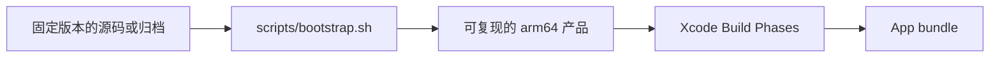

# 外部组件与构建依赖

kmgccc_player 的 Swift 代码由 Xcode 构建，歌词渲染、歌词搜索、封面候选和系统播放状态读取还依赖若干独立运行组件。`scripts/bootstrap.sh` 统一取得、校验和构建这些组件，Xcode 只消费 bootstrap 生成的产品。



## 准备环境

```sh
./scripts/bootstrap.sh
```

首次运行会下载依赖并构建 Apple Silicon 产物，之后根据源码、工具链和架构状态复用缓存。CI 与本地开发使用同一入口，贡献者不需要手工寻找或替换二进制文件。

支持按组件检查或重建：

```sh
./scripts/bootstrap.sh --check
./scripts/bootstrap.sh --check --component amll
./scripts/bootstrap.sh --force --component amll
```

组件名为 `amll`、`lddc`、`mediaremote`、`sacad` 和 `qqmusic`。QQ Music 运行组件根据 [`components.lock.json`](../qqmusic/integration/components.lock.json) 从正式 Release 下载并核验；可重放补丁包只包含宿主侧改动，不携带二进制。

## 组件概览

| 组件 | 运行边界 | 用途 | 失败时的降级 |
| --- | --- | --- | --- |
| AMLL background | 隔离的背景 WKWebView | Now Playing 的网格背景动画 | 背景不可用，歌词与其他播放功能不受影响 |
| LDDC Fetch Core | 本机回环 HTTP 服务 | 多来源歌词搜索、获取和格式处理 | LDDC 搜索不可用，本地 AMLL DB 仍可用 |
| QQMusicApi_HelperNext | stdin/stdout JSON 子进程 | QQ 音乐浏览、登录、下载和元数据等宿主数据服务 | 在线服务不可用；本地曲库与其他数据来源独立 |
| MediaRemoteAdapter | 原生 framework 与流式 JSON | 系统 Now Playing 状态和控制 | 系统外部播放不可用，本地与 Apple Music 独立 |
| SACAD | 单次命令行进程 | 专辑封面搜索和下载 | SACAD 候选不可用 |

这些组件都按进程或 WebView 边界隔离。Swift 侧只依赖稳定协议，不直接调用第三方服务内部 API。

## AMLL

[applemusic-like-lyrics](https://github.com/amll-dev/applemusic-like-lyrics) 的资源目前只用于 Now Playing 的网格背景。歌词已经完全由原生 Swift/MelismaKit 组件渲染，不再构建或加载 AMLL 的歌词 DOM、TTML parser、bridge 或歌词 WebView fallback。

AMLL 集成层只从固定 submodule 版本构建 `amll-background.js`，由 bundle 内的 `background.html` 加载；Inter 字体仍作为 App 资源注册。生成 JavaScript 不作为手工编辑入口。

许可证：AGPL-3.0-only。宿主调度边界和时间算法见 [歌词渲染系统](lyric-rendering.md)。

## LDDC Fetch Core

[LDDC](https://github.com/chenmozhijin/LDDC) 的无界面 fetch core 被封装为本机 HTTP 服务，由 `LDDCServerManager` 按需启动。服务提供健康检查、搜索和歌词格式处理，Swift 不需要嵌入 Python 解释器 API。

bootstrap 使用 ARM64 Python 与 PyInstaller 生成 onedir 产品。运行时只使用 App bundle 中的服务，不依赖系统 Python 或开发目录。

许可证：GPL-3.0-only。

## QQMusicApi_HelperNext 与 Aria2 Next

[QQMusicApi_HelperNext](https://github.com/LeeDespo/QQMusicApi_HelperNext) 是独立维护的数据组件，宿主通过 `QQMusicComponentProcess` 使用逐行 JSON 的 stdin/stdout 协议交互；请求、签名、上游响应解析和凭据处理由组件仓库维护。本仓库不复制 endpoint、queryId 或组件内部实现文档。宿主负责进程生命周期、在线页面状态、缓存、下载入库与播放器衔接。

[Aria2 Next](https://github.com/AnInsomniacy/aria2-next) 作为独立下载引擎随锁定资产准备；运行时缺席时可回退宿主下载路径。正式物化、打包和随包许可证以 [`components.lock.json`](../qqmusic/integration/components.lock.json)、[`qqmusic/RELEASING.md`](../qqmusic/RELEASING.md) 和实际构建结果为准。HelperNext 可优先从用户 Application Support 的 `QQMusicHelperNext/` 外部目录加载，bundle 内为默认交付；其他依赖不因此获得任意路径 fallback。

HelperNext 许可证为 GPL-3.0-or-later，Aria2 Next 为 GPL-2.0；本仓库的分发义务和来源见根目录 [`NOTICE`](../NOTICE)。

## MediaRemoteAdapter

[MediaRemoteAdapter](https://github.com/ungive/mediaremote-adapter) 负责读取 macOS 系统正在播放的外部媒体状态，并提供当前可用的控制能力。`SystemNowPlayingProvider` 消费它的流式 JSON，维护连接状态、稳定曲目和进度基线。

bootstrap 从固定源码构建 Apple Silicon framework 与 client，避免提交或信任来源不明的预编译 framework。

许可证：BSD-3-Clause。

## SACAD

[SACAD](https://github.com/desbma/sacad) 按歌手、专辑和尺寸搜索封面。App 通过 `CoverDownloadService` 调用命令行程序，结果进入共享候选管线，SACAD 不直接修改资料库。

bootstrap 使用固定的 macOS ARM64 预编译产物并校验归档，不在本地重复编译。

许可证：MPL-2.0。

## Swift Package

工程通过 Swift Package Manager 使用以下编译期依赖，由 Xcode 根据已固定的 package resolution 解析；它们不进入 bootstrap 的外部进程构建链：

- [MelismaKit](https://github.com/kmgcc/melismakit)：原生 Swift 歌词排版度量与动效渲染引擎。
- [WhatsNewKit](https://github.com/SvenTiigi/WhatsNewKit)：更新说明展示。
- [PLCrashReporter](https://github.com/microsoft/plcrashreporter)：在主 App 进程发生异常退出时生成 crash-safe pending report；App 只在下一次正常启动时导入和处理报告。
- [Sparkle](https://github.com/sparkle-project/Sparkle)：应用自动更新检查与交付框架。

## 可复现构建

bootstrap 把下载、源码、中间工作目录、最终产品和日志分开保存。Xcode 只复制最终产品，不从下载缓存、虚拟环境或构建中间目录取文件。

组件检查会验证锁定版本、校验值、工具链状态、产品结构和 `arm64` 架构。LDDC 等上游运行组件从 App bundle 解析，不扫描仓库路径，也不回退到系统解释器。QQ Music 数据组件例外：用户 Application Support 下的 `QQMusicHelperNext/` 可作为优先覆盖目录，bundle 是默认副本；不从任意环境变量加载替代文件。

这条边界保证干净 clone、CI 和日常开发使用相同产品布局，也让单个组件失败时能够沿表中的方式独立降级。

## 许可证

第三方许可证文本随 App 一同提供：

| 组件 | 许可证 |
| --- | --- |
| AMLL | AGPL-3.0-only |
| MelismaKit | AGPL-3.0-only |
| LDDC Fetch Core | GPL-3.0-only |
| QQMusicApi_HelperNext | GPL-3.0-or-later |
| Aria2 Next | GPL-2.0 |
| MediaRemoteAdapter | BSD-3-Clause |
| SACAD | MPL-2.0 |
| WhatsNewKit | MIT |
| PLCrashReporter | MIT；内含 protobuf-c Apache-2.0 部分 |
| Sparkle | MIT |
