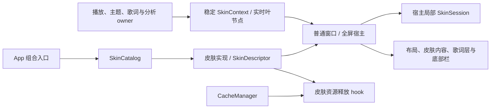

# 皮肤基础重构记录

实施日期为 2026-10-05，起点为 `f9e4e95b` 与当日工作树。范围限于[演进计划](skin-system-evolution-plan.md)的 P0–P2，保留已有皮肤、几何、配置值和交互。ZIP 导入、自由场景编排、Web 皮肤与市场仍在后续阶段。

本次按维护者要求先跑通，不增加测试工程或安全框架。构建与主 App 运行结果在文末记录，未完成的检查明确标记。

## P0 基线

开始实施时没有运行中的 `kmgccc_player` 主进程，记录来自 `scripts/check-app-process-state.sh`。当时已有播放、音频、资料库、测试与其他文档改动，本次不覆盖这些改动。

以下记录当前代码的既有规则。UI 截图与主 App 操作证据另行记录，源码表格不代替运行验收。

| 皮肤身份 | 普通窗口 / 全屏 | 窗口可视化默认 | 全屏可视化默认 | 全屏封面比例 / 上限 | 背景与歌词策略 |
| --- | --- | --- | --- | --- | --- |
| `coverLed` | 支持 / 支持 | mini player 频谱 | mini player LED | 1.1 / 1.35 | 宿主背景、标准歌词、chrome 控制色 |
| `appleStyle` | 支持 / 支持 | mini player LED | 皮肤 LED | 1.1 / 1.45 | 皮肤网格背景、原生歌词自适应色、固定明亮控制色 |
| `rotatingCover` | 支持 / 支持 | mini player 频谱 | mini player 频谱 | 1.1 / 1.35 | 宿主背景、标准歌词、chrome 控制色 |
| `kmgccc.cassette` | 支持 / 支持 | mini player LED | 关闭 | 1.25 / 1.6 | 宿主背景、磁带前景资源配置、标准歌词 |
| `fullscreen.coverGradientBlur` | 不支持 / 支持 | 不提供窗口选择 | mini player 频谱 | 1.0 / 1.0 | 封面作为背景、原生歌词自适应色、封面自适应控制色 |

普通窗口初始皮肤为磁带。全屏旧配置的缺失/未知 ID 回退、重置默认与注册表默认在旧实现中各有入口，本次保持各入口的既有结果，没有借重构统一成另一套默认。全屏选择顺序仍将封面背景皮肤置于最前，其他皮肤保持登记顺序。

现有每皮肤可视化选择、全屏字号配置、封面比例与历史迁移键保留。旧生成默认值的识别只服务迁移，不参与新皮肤身份校验。磁带虽然支持 LED 呈现，现有全屏配置的 embedded visualizer 能力仍为关闭，本次不擅自修订这项产品语义。

生命周期基线包括封面图片/checksum/display identity 一起提交，稳定展示与实时播放时钟分离，频谱共用分析服务，原生歌词 surface 在切换皮肤时保持挂载。普通窗口、系统全屏、窗口模拟全屏与主窗口内嵌分别保留现有宿主职责。

## P1 登记与契约

`SkinCatalog` 持有唯一的可观察皮肤集合，提供登记和按宿主过滤；`SkinRegistry` 保留现有调用入口，统一委托给这个集合。`SkinManager` 接收同一 catalog，App 的组合入口显式传入，视图不创建第二套登记服务。



每个 `NowPlayingSkin` 提供一个 `SkinDescriptor`，其中声明元数据、支持模式、呈现策略、可视化默认、封面比例与字号默认。宿主根据行为声明工作；新身份只需登记，不要求修改 `FullscreenSkinID`。该枚举保留旧代码的标识兼容，其能力查询也委托给描述。

策略按背景归属、背景调暗、前景封面/背景封面、歌词背景与控制色等独立职责组织。当前原生策略适配保持已有输出；复杂新排版留给 P3 的场景/组件契约，不在基础阶段继续增加皮肤名称分类。

旧设置 namespace、生成默认值和唱片入口布尔设置保留在对应描述的可选兼容信息里。当前默认值由描述提供，历史字体迁移继续集中识别旧值。普通设置的数量与交互保持现状，少量联动参数属于后续产品设计。

`SkinContext` 移除无人消费的 audio/LED 快照、播放时间和进度，以及旧背景、mesh、kick 和玻璃参数。主题快照仅保留当前消费者需要的颜色与封面/频谱色语义。磁带色板由磁带自身的环境适配传给渲染视图，继续消费 ThemeStore 的同一语义色；公共上下文不认识磁带色板。

频谱 consumer 继续订阅已有 provider，播放进度与歌词时间继续从原来的实时叶节点同步。普通 Now Playing 与父层皮肤背景读取稳定展示，避免无用的播放时间变化推动整层皮肤重建。

### 新皮肤入口

`MinimalSkinExample` 提供最小原生开发样例。仅 Debug App 带以下参数启动时加入 catalog，普通启动和 Release 的皮肤列表不增加这个样例。

```sh
./scripts/build_and_run.sh run --skin-development-example
```

样例声明独立 ID、能力与默认值，绘制已有封面和共用背景，没有新增设置键映射、全屏枚举成员或公共宿主 ID 分支。正式新增同类皮肤可以沿用如下流程。

1. 实现 `NowPlayingSkin` 的描述与绘制入口。
2. 在组合入口向同一 `SkinCatalog` 登记实现。
3. 按需要声明可视化、外观默认与缓存释放；历史兼容信息可省略。
4. 分别查看所声明宿主的真实输出；全新布局在 P3 接入独立场景实现。

## P2 宿主与生命周期

`SkinSession` 属于每个皮肤宿主，维护切换 identity、异步工作的取消和 generation。普通与全屏宿主使用同一语义，保持各自实例；它不接管播放、主题、歌词或资料库服务。封面准备在提交前检查当前 generation，过期结果不能进入另一次皮肤会话。

各皮肤通过 `releaseCachedResources()` 释放自己的派生资源。`CacheManager` 继续管理共享封面、主题等缓存，通过注册表分发皮肤资源清理，不再逐个调用磁带、唱片、封面背景类。新增皮肤不必修改全局清理名单。

全屏拆分采用专用布局值、呈现组件、输入适配和局部协调器。持续挂载的原生歌词层仍在皮肤 identity 子树之外；窗口角色、依赖接入和准备后的展示仍由场景宿主组合。主文件由 5,718 行减至 4,215 行，迁移了状态与副作用，保留现有 surface 接管与窗口过渡。后续 P3 再沿场景与组件边界拆开剩余原生适配。

| 独立职责 | 实现 |
| --- | --- |
| 水平布局计算 | `FullscreenHorizontalSplitLayout` |
| 皮肤封面、叠加层和共享右键菜单 | `FullscreenSkinArtworkArea`、`FullscreenSkinContextMenu` |
| 底部栏呈现、几何与动作输入 | `FullscreenBottomBarView` |
| 底部栏悬停、展开、显隐与收起任务 | `FullscreenBottomControlsCoordinator` |
| 原生歌词/队列层与挂载布局 | `FullscreenNativeLyricsLayer`，输入按布局、呈现、队列与动作分组 |
| 歌词末尾自动隐藏、恢复、主题状态与延时任务 | `FullscreenLyricsCoordinator` |
| 实时播放时钟同步 | `FullscreenPlaybackSyncView` |
| 歌词区域与底部栏的指针遮挡监听 | `FullscreenPointerOcclusionMonitor` |
| TTML 主歌词最后结束时间解析 | `FullscreenTTMLTimingExtractor` |
| 封面区域音量滚轮适配 | `PanoramicArtworkVolumeScrollArea` |

歌词协调器的八类延时任务通过 `schedule` / `cancel` 管理，宿主不读取或写入 `DispatchWorkItem`。底部栏协调器的任务同样保持私有，退出时统一取消。调度仍使用原来的时长与主队列行为，零延时的同步 track refresh 单独保留。

现有封面/背景/歌词/mini player 工厂与固定场景几何仍通过旧适配存在。P0–P2 完成基础边界，P3 才开放开发者自由组件树，P5 才接入可导入的 Web 内容，不把未来能力记为已经实现。

### 后续开发边界

| 改动 | 负责位置 |
| --- | --- |
| 新增原生皮肤、元数据、能力与默认外观 | 皮肤实现的 `SkinDescriptor`，并在同一 catalog 登记 |
| 现有皮肤专用颜色、素材和绘制参数 | 对应皮肤内部适配与渲染，不扩充公共 `SkinContext` |
| 新增皮肤专用缓存 | 皮肤的 `releaseCachedResources()`；共享缓存仍归共享服务 |
| 宿主中的局部异步工作 | 该宿主的 `SkinSession`；SwiftUI `.task` 继续使用结构化取消 |
| 实时播放进度、歌词时间与音频分析 | 原来的实时叶节点、歌词服务和共享分析 provider |
| 开放全新场景排版、导入或 Web bridge | P3–P5 的独立契约，依据已确认的产品行为接入 |

普通皮肤与全屏皮肤的配置继续独立。历史字体与音频默认迁移仍识别已有键和值；增加新身份不需要给它补一个历史枚举成员。`MinimalSkinExample` 的开发参数只是本阶段的原生登记证明，后续开发目录重载按 P6 实施。

## 验证记录

- Debug 构建通过，输出位于 `build/DerivedData-SkinP0P2-20261005`，日志为 `build/logs/skin-p0-p2-debug.log`。
- 本地 MelismaKit 依赖前置通过，构建日志包含 `NativeLyrics/Sources/MelismaKit` 的实际 Swift 编译输入。
- `git diff --check` 通过。工作树原有的播放、音频、资料库与测试改动保留。
- 经 `scripts/build_and_run.sh` 启动主 App，脚本确认只有一个主进程，实际二进制来自上述 Debug 产物。界面读取已看到加载完成的资料库和暂停的当前歌曲。
- 带 `--skin-development-example` 的主 App 启动成功；随后恢复普通启动，不增加用户日常选择列表。样例的实际选择与画面尚未确认。
- 界面操作工具在打开设置后持续返回 `Sky Computer Use native pipe closed before response`，重连与重启主 App 后仍复现；进程仍在运行。因此不把启动成功写成皮肤切换与全屏视觉验收通过。
- 按本轮要求，未新增或运行自动化测试、UI 一致性脚本、完整 smoke、Release 构建和安全评估。

| 主 App 路径 | 当前证据 | 未覆盖边界 |
| --- | --- | --- |
| 普通窗口 | 新 Debug App 启动，资料库和当前歌曲已加载 | 支持该宿主的皮肤画面比对、样例选择、旧设置恢复 |
| 系统全屏 | 路由、宿主与资源边界已迁移并编译 | 进入、切换、退出和歌词挂载的实际行为 |
| 窗口模拟全屏 | 保留原窗口管理入口，迁移后的内容编译通过 | 进入、缩放、切换和退出 |
| 主窗口内嵌 | 保留原生歌词与共享封面接管顺序 | 进入、切换、退出和旧封面恢复 |
| 重复切换与退出 | 会话取消、generation 提交检查和协调器回收入口已落地 | 持续订阅、渲染实例和任务数量未实测 |

P0–P2 的实现与构建已落地，完整运行验收仍有上述边界。默认值、过渡效果和交互未新增产品决定；自由排版、导入流程、Web 混合与市场的待答问题继续以演进计划为准。
